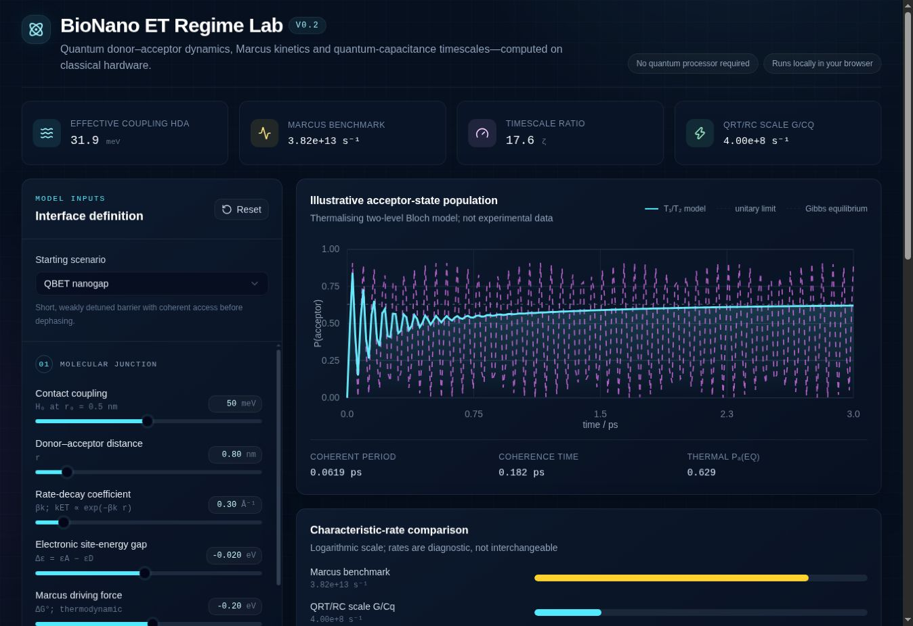

# BioNano ET Regime Lab

BioNano ET Regime Lab is a deterministic browser application for examining assumptions in reduced-order electron-transfer models at bio-nano interfaces. It combines:

- distance-dependent donor-acceptor coupling;
- thermalising two-state Bloch dynamics;
- a nonadiabatic Marcus-rate benchmark;
- conductance-capacitance characteristic rates; and
- transparent dimensionless diagnostics.

The software is intended for **hypothesis generation, dimensional checking, teaching and experiment design**. It does not establish quantum coherence, infer a transport mechanism, predict cellular responses or replace molecular dynamics, continuum electrostatics, stochastic electron counting or experimental validation.



## Release status

This repository contains **BioNano ET Regime Lab v0.2.2**. The equations and deterministic checks are implemented and tested, but independent held-out experimental validation and a biological observation model remain outstanding. It must not be described as a validated predictive package.

## Run locally

No production dependencies or build step are required.

```bash
git clone REPOSITORY_URL
cd bionano-et-regime-lab
python3 -m http.server 8000
```

Then open <http://localhost:8000> in a current browser.

Opening `index.html` directly is not recommended because browsers may restrict JavaScript modules loaded from `file://` URLs.

## Run the verification suite

Node.js 20 or newer is required only for development and testing.

```bash
npm test
```

The tests cover:

- zero coupling and zero detuning;
- the rate-decay/coupling factor-of-two convention;
- Gibbs equilibrium for the thermalising two-state model;
- the relation `Gamma2 = gamma_phi + Gamma1/2`;
- the activationless Marcus condition;
- conductance-capacitance units;
- deterministic propagation and convergence; and
- the documented QBET-nanogap reference values.

## Model conventions

| Quantity | Input unit | Internal convention |
|---|---:|---|
| Contact coupling, `H0` | meV | converted to eV |
| Separation, `r`, `r0` | nm | difference converted to angstrom |
| Rate-decay coefficient, `beta_k` | angstrom^-1 | coupling uses `exp[-beta_k(r-r0)/2]` |
| Site-energy gap, `Delta epsilon = epsilon_A - epsilon_D` | eV | independent of Marcus driving force |
| Marcus driving force, `Delta G0` | eV | local value `Delta G = Delta G0 - eta` |
| Reorganisation energy, `lambda` | eV | classical-nuclear Marcus benchmark |
| Relaxation/dephasing | ps^-1 | `Gamma2 = gamma_phi + Gamma1/2` |
| Conductance | nS | converted to siemens |
| Quantum capacitance | aF | converted to farads |

Full definitions are in [`docs/scientific-method.md`](docs/scientific-method.md). Interpretive boundaries are in [`docs/limitations.md`](docs/limitations.md).

## Repository structure

```text
index.html                 Browser interface
app.js                     UI and chart rendering
src/model.js               Scientific calculation core
src/scenarios.js           Four illustrative parameter sets
tests/model.test.js        Automated numerical checks
examples/                  Machine-readable example inputs
docs/scientific-method.md  Equations, units and assumptions
docs/limitations.md        Scientific and software limitations
```

## Reproducibility

The application has no random component. The same parameter object returns the same outputs. Input and output values can be exported as JSON from the interface. Populations are clipped to `[0,1]` only for plotting; the un-clipped Bloch trajectory remains available in the returned model object.

## Citation

Until a journal article or archived release DOI is available, cite the software using [`CITATION.cff`](CITATION.cff). After creating a tagged GitHub release, archive that exact release with Zenodo and add the DOI to this README, `CITATION.cff` and the accompanying manuscript.

## Contributing and support

Use the repository issue tracker for reproducible bugs, unit concerns and proposed extensions. Please read [`CONTRIBUTING.md`](CONTRIBUTING.md) before proposing changes to equations or physical conventions.

## Licence

MIT. See [`LICENSE`](LICENSE).

## AI-use disclosure

AI-assisted tools were used during software implementation, drafting, structural editing and documentation. The author is responsible for reviewing and validating all scientific claims, equations, calculations and released code.
## Jain 2024 GNP100 external comparison

Version 0.2.1 includes a reproducible comparison with the GNP100 polyethylene-glycol linker data reported by Jain et al. in Nature Nanotechnology.

Source article: https://doi.org/10.1038/s41565-023-01496-y

The analysis compares two distance-decay coefficients:

- An independent Page–Moser–Chen–Dutton coefficient of 1.382 Å⁻¹.
- A data-derived apparent slope of 0.023 Å⁻¹ reported for the same experimental dataset.

Run the comparison with:

```bash
npm run jain:gnp100
```

## Reproducible GNP100 Monte Carlo uncertainty analysis

Version 0.2.1 includes a fixed-seed, 100,000-draw uncertainty analysis of the GNP100 polyethylene-glycol linker data reported by Jain et al. in *Nature Nanotechnology* (https://doi.org/10.1038/s41565-023-01496-y).

Run the analysis with:

```bash
npm run jain:gnp100:monte-carlo
```

The analysis independently samples the published linker-length and biological charging-rate means and standard deviations using Gaussian distributions. Non-positive sampled values are rejected and resampled.

Each draw estimates the apparent decay coefficient using `ln(r_d) = intercept - α × linker length`.

The fixed-seed v0.2.1 result when both length and rate uncertainties are propagated is:

- Median α: 0.17214 nm⁻¹
- 95% interval: 0.02099–0.40002 nm⁻¹
- P(α > 0): 0.98343

The analysis creates:

- `results/jain-2024-gnp100-monte-carlo-summary.json`
- `results/jain-2024-gnp100-monte-carlo-draws.csv.gz`

The compressed CSV contains all 100,000 draw-level α values for both the rate-only and length-plus-rate scenarios. The automated test reruns the calculation twice, verifies byte-for-byte reproducibility and checks the expected numerical summaries.

This analysis propagates uncertainty in published summary measurements. It is not a stochastic electron-transfer simulation and does not validate a microscopic mechanism.